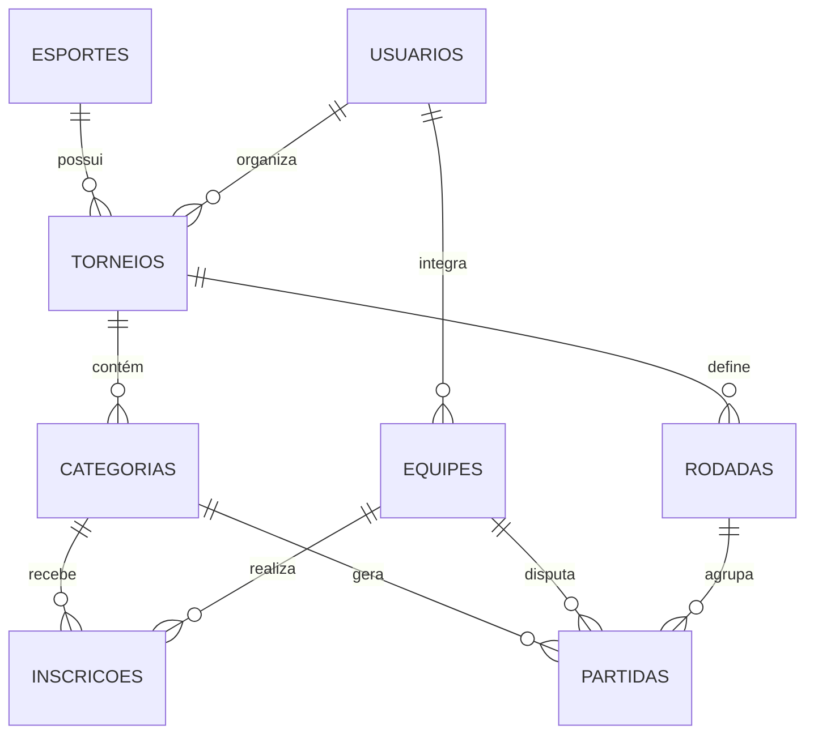

## 1. Arquitetura do Sistema

### 1.1 Visão Geral
O sistema segue uma arquitetura moderna baseada em Next.js (App Router), utilizando o conceito de "API-First". A lógica de negócio é encapsulada em serviços, que são expostos via API REST e consumidos pelo Frontend. O banco de dados PostgreSQL é gerenciado via Drizzle ORM.

```mermaid
graph TD
    Client[Frontend (Browser/Mobile)] --> API[API Layer (Next.js Route Handlers)]
    API --> Services[Service Layer (Business Logic)]
    Services --> DB[(Database - PostgreSQL)]
    Services --> Auth[Supabase Auth]
    Services --> Storage[Supabase Storage]
```

### 1.2 Tecnologias
-   **Frontend/API**: Next.js 15+ (App Router)
-   **Linguagem**: TypeScript
-   **Estilização**: Tailwind CSS + Shadcn/ui (para visual moderno)
-   **ORM**: Drizzle ORM
-   **Banco de Dados**: PostgreSQL (Supabase)
-   **Autenticação**: Supabase Auth
-   **Validação**: Zod

## 2. Estrutura de Pastas (Sugestão)

```
src/
├── app/
│   ├── (frontend)/       # Páginas da UI (consomem services/API)
│   │   ├── admin/        # Área do organizador
│   │   ├── (public)/     # Área pública
│   │   └── layout.tsx
│   ├── api/              # Endpoints REST (expõem services)
│   │   ├── v1/
│   │       ├── torneios/
│   │       └── ...
├── components/           # Componentes React (Atomic Design ou similar)
│   ├── ui/               # Componentes base (shadcn)
│   ├── domain/           # Componentes de negócio
├── services/             # Regra de Négocio Pura (Backend Core)
│   ├── torneio.service.ts
│   ├── inscricao.service.ts
├── db/                   # Configuração do Banco
│   ├── schema/           # Definição das tabelas
│   └── index.ts
├── lib/                  # Utilitários
└── types/                # Tipagem global
```

## 3. Modelo de Dados (Schema em Português)

O banco de dados utiliza tabelas e colunas em português para facilitar o entendimento e manutenção, conforme solicitado.



### 3.1 Definição das Tabelas (SQL/Drizzle)

**Tabela: esportes**
- `id` (uuid, pk)
- `nome` (varchar) - Ex: Beach Tennis, Padel
- `slug` (varchar, unique)
- `criado_em` (timestamp)

**Tabela: usuarios**
- `id` (uuid, pk)
- `nome` (varchar)
- `email` (varchar, unique)
- `senha` (varchar) - Hash (gerenciado pelo Supabase Auth, tabela espelho ou uso direto)
- `perfil` (enum: 'admin', 'organizador', 'atleta')
- `foto_url` (varchar)
- `criado_em` (timestamp)

**Tabela: torneios**
- `id` (uuid, pk)
- `nome` (varchar)
- `slug` (varchar, unique) - Para URL amigável
- `descricao` (text)
- `data_inicio` (date)
- `data_fim` (date)
- `local` (varchar)
- `status` (enum: 'rascunho', 'aberto', 'em_andamento', 'finalizado', 'cancelado')
- `esporte_id` (uuid, fk -> esportes)
- `organizador_id` (uuid, fk -> usuarios)
- `logo_url` (varchar)
- `banner_url` (varchar)
- `criado_em` (timestamp)
- `atualizado_em` (timestamp)

**Tabela: categorias**
- `id` (uuid, pk)
- `torneio_id` (uuid, fk -> torneios)
- `nome` (varchar) - Ex: Mista C, Feminino PRO
- `genero` (enum: 'M', 'F', 'Misto')
- `tipo` (enum: 'idade', 'nivel', 'livre')
- `valor_inscricao` (decimal)
- `vagas_maximas` (int)
- `sistema_pontuacao` (json) - Configuração de sets/games
- `criado_em` (timestamp)

**Tabela: equipes** (Generalização de Duplas)
- `id` (uuid, pk)
- `nome` (varchar) - Opcional, ou nome dos atletas concatenado
- `criado_em` (timestamp)
-- Tabela de junção equipe_atletas seria necessária para N atletas, mas para MVP de duplas podemos simplificar ou usar tabela pivo.
-- Sugestão: Tabela `equipe_integrantes` para flexibilidade (vôlei 6 pessoas, BT 2 pessoas).

**Tabela: equipe_integrantes**
- `equipe_id` (uuid, fk -> equipes)
- `usuario_id` (uuid, fk -> usuarios)

**Tabela: inscricoes**
- `id` (uuid, pk)
- `torneio_id` (uuid, fk -> torneios)
- `categoria_id` (uuid, fk -> categorias)
- `equipe_id` (uuid, fk -> equipes)
- `status` (enum: 'pendente', 'aprovado', 'recusado', 'fila_espera')
- `comprovante_url` (varchar)
- `data_inscricao` (timestamp)

**Tabela: rodadas**
- `id` (uuid, pk)
- `torneio_id` (uuid, fk -> torneios)
- `nome` (varchar) - Ex: Rodada 1, Quartas de Final
- `ordem` (int)
- `data_inicio` (timestamp)
- `data_fim` (timestamp)
- `status` (enum: 'agendada', 'em_andamento', 'concluida')

**Tabela: partidas**
- `id` (uuid, pk)
- `torneio_id` (uuid, fk -> torneios)
- `categoria_id` (uuid, fk -> categorias)
- `rodada_id` (uuid, fk -> rodadas)
- `equipe_a_id` (uuid, fk -> equipes)
- `equipe_b_id` (uuid, fk -> equipes)
- `placar_a` (int) - Sets vencidos
- `placar_b` (int) - Sets vencidos
- `detalhes_placar` (json) - Ex: `[{set: 1, a: 6, b: 2}, {set: 2, a: 6, b: 4}]`
- `vencedor_id` (uuid, fk -> equipes)
- `status` (enum: 'pendente', 'agendada', 'em_andamento', 'finalizada', 'wo')
- `quadra` (varchar)
- `data_horario` (timestamp)
- `observacoes` (text)

## 4. Definições da API (Endpoints Principais)

Todos os endpoints estarão sob `/api/v1`.

### Torneios
- `GET /torneios`: Lista torneios (filtros: esporte, status).
- `GET /torneios/:slug`: Detalhes completos.
- `POST /torneios`: Cria novo torneio (Admin/Org).
- `PUT /torneios/:id`: Atualiza dados.

### Categorias
- `GET /torneios/:id/categorias`: Lista categorias.
- `POST /torneios/:id/categorias`: Adiciona categoria.

### Inscrições
- `POST /inscricoes`: Realiza inscrição.
- `GET /inscricoes/me`: Minhas inscrições.

### Partidas
- `GET /torneios/:id/partidas`: Tabela de jogos.
- `PATCH /partidas/:id/resultado`: Atualiza placar.
