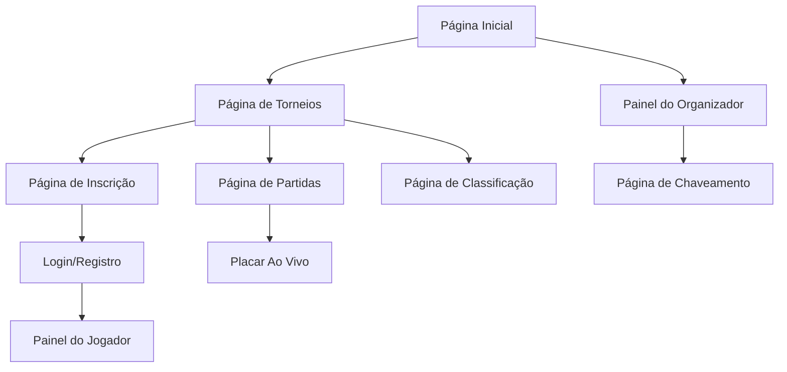

# 1. Visão Geral do Produto

O Gerenciador de Torneio de Beach Tennis é uma plataforma completa para organização e acompanhamento de torneios de beach tennis. O sistema permite que jogadores se registrem e gerenciem seus perfis, organizadores criem e administrem torneios com chaveamentos e cronogramas, e o público acompanhe resultados e classificações em tempo real.

O produto visa simplificar o processo de gestão de torneios, eliminando planilhas e controles manuais, proporcionando uma experiência digital moderna para todos os envolvidos no esporte.

## 2. Funcionalidades Principais

### 2.1 Papéis de Usuário

| Papel | Método de Cadastro | Permissões Principais |
|-------|-------------------|----------------------|
| Jogador | Cadastro com email | Visualizar torneios, se inscrever, atualizar perfil, ver resultados |
| Organizador | Cadastro com email + verificação | Criar torneios, gerenciar inscrições, gerar chaveamentos, lançar resultados |
| Público | Acesso sem cadastro | Visualizar torneios, placar ao vivo, classificações |

### 2.2 Módulos de Funcionalidades

O sistema de gerenciamento de torneios consiste nas seguintes páginas principais:

1. **Página Inicial**: Apresentação do sistema, destaque de torneios ativos, navegação principal
2. **Página de Torneios**: Listagem de torneios com filtros por data, local e categoria
3. **Página de Inscrição**: Formulário de inscrição para jogadores com validação de dados
4. **Painel do Jogador**: Perfil do jogador, histórico de torneios, estatísticas
5. **Painel do Organizador**: Gerenciamento de torneios, controle de inscrições, geração de chaves
6. **Página de Chaveamento**: Visualização das chaves de jogos em formato de árvore
7. **Página de Partidas**: Cronograma de jogos, atualização de resultados, placar ao vivo
8. **Página de Classificação**: Tabelas de classificação por categoria, estatísticas detalhadas
9. **Página de Login/Registro**: Autenticação de usuários, recuperação de senha

### 2.3 Detalhamento das Páginas

| Página | Módulo | Descrição das Funcionalidades |
|--------|--------|-------------------------------|
| Página Inicial | Hero Banner | Apresentação visual do sistema com imagens de beach tennis e call-to-action para explorar torneios |
| Página Inicial | Lista de Torneios | Cards com torneios em destaque, mostrando data, local, número de vagas e status |
| Página Inicial | Navegação | Menu principal com acesso rápido para diferentes seções do sistema |
| Página de Torneios | Filtros e Busca | Filtros por data, local, categoria (masculino, feminino, misto), status (aberto, em andamento, finalizado) |
| Página de Torneios | Cards de Torneio | Informações resumidas com imagem, data, local, valor da inscrição, botão para detalhes |
| Página de Inscrição | Formulário | Campos para dados pessoais, categoria de jogo, dupla (se aplicável), pagamento |
| Página de Inscrição | Validação | Validação de CPF, idade mínima, categoria permitida, disponibilidade de vagas |
| Painel do Jogador | Perfil | Dados pessoais, foto, ranking, estatísticas (vitórias/derrotas) |
| Painel do Jogador | Histórico | Lista de torneios participados com resultados e posições alcançadas |
| Painel do Organizador | Criar Torneio | Formulário com nome, data, local, categorias, número de vagas, valor inscrição |
| Painel do Organizador | Gerenciar Inscrições | Aprovar/reprovar inscrições, visualizar lista de inscritos por categoria |
| Painel do Organizador | Gerar Chaveamento | Sistema automático de sorteio e geração de chaves de eliminação simples ou dupla |
| Página de Chaveamento | Visualização em Árvore | Estrutura visual das chaves mostrando confrontos, vencedores e próximas fases |
| Página de Partidas | Cronograma | Tabela com data, hora, quadra, categorias, jogadores envolvidos |
| Página de Partidas | Atualização de Resultados | Interface para organizadores lançarem placares e atualizarem status das partidas |
| Página de Partidas | Placar Ao Vivo | Atualização em tempo real dos jogos em andamento com pontuação detalhada |
| Página de Classificação | Tabelas | Classificação geral por categoria com pontos, vitórias, saldo de games |
| Página de Classificação | Estatísticas | Gráficos e métricas detalhadas de desempenho dos jogadores |
| Login/Registro | Autenticação | Formulários de login, registro de novo usuário, recuperação de senha via email |

## 3. Fluxos Principais

### Fluxo do Jogador
O jogador acessa a página inicial, navega até a lista de torneios, seleciona um torneio aberto para inscrição, preenche o formulário com seus dados e categoria desejada, aguarda aprovação da inscrição pelo organizador, acompanha o andamento do torneio através do painel pessoal e visualiza seus resultados e classificação.

### Fluxo do Organizador
O organizador cria um novo torneio configurando todas as informações necessárias, divulga o torneio e aguarda as inscrições, analisa e aprova as inscrições recebidas, gera o chaveamento automaticamente quando as inscrições são encerradas, atualiza os resultados das partidas conforme o torneio progride e acompanha a classificação geral do torneio.

### Fluxo do Público
O público acessa a página inicial ou diretamente a página de torneios, visualiza os torneios ativos e suas informações, acompanha o placar ao vivo das partidas em andamento e consulta as classificações atualizadas dos jogadores e torneios.

## 4. Design da Interface

### 4.1 Estilo de Design

- **Cores Primárias**: Azul marinho (#1E3A8A) representando o oceano, Bege claro (#FEF3C7) representando a areia
- **Cores Secundárias**: Branco (#FFFFFF) para áreas de destaque, Verde (#059669) para ações positivas
- **Estilo de Botões**: Arredondados com sombra suave, hover effects com transições suaves
- **Tipografia**: Fonte sans-serif moderna (Inter ou similar), títulos em 24-32px, texto corporal em 14-16px
- **Layout**: Baseado em cards com bordas arredondadas, navegação superior fixa, design limpo e arejado
- **Ícones**: Estilo outline com temas de esporte, troféus, raquetes, bolas

### 4.2 Visão Geral das Páginas

| Página | Módulo | Elementos de UI |
|--------|--------|-----------------|
| Página Inicial | Hero Banner | Imagem full-width de beach tennis, texto sobreposto com call-to-action, altura de 60vh |
| Página Inicial | Cards de Torneio | Grid responsivo com cards de 300px, sombra suave, hover scale effect, badge de status colorido |
| Página de Torneios | Filtros Laterais | Sidebar colapsável com checkboxes e date pickers, botão de aplicar filtros em destaque |
| Página de Inscrição | Formulário Multi-step | Progress bar no topo, validação em tempo real, campos obrigatórios marcados com asterisco |
| Painel do Jogador | Header do Perfil | Foto circular 120px, nome em fonte 24px bold, estatísticas em cards compactos |
| Painel do Organizador | Dashboard | Cards métricos com números grandes, gráficos de inscrições, tabela de ações pendentes |
| Página de Chaveamento | Árvore de Jogos | Estrutura horizontal responsiva, conectores visuais entre fases, hover mostra detalhes |
| Página de Partidas | Tabela de Jogos | Striped rows, status colorido (verde=ativo, cinza=finalizado), botões de ação alinhados |
| Placar Ao Vivo | Scoreboard | Layout fullscreen opcional, números grandes e legíveis, atualização suave com animação |

### 4.3 Responsividade

O sistema será desenvolvido com abordagem desktop-first, totalmente responsivo para tablets e smartphones. Breakpoints principais: Desktop (1200px+), Tablet (768px-1199px), Mobile (até 767px). Elementos de toque otimizados para dispositivos móveis com áreas de clique mínimas de 44
